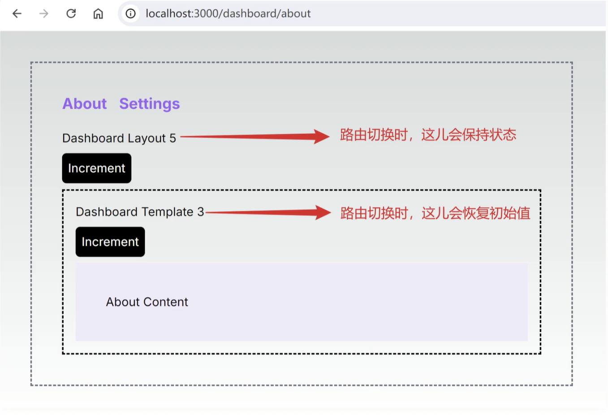

# Next.js 基础

### 1. 创建Next.js项目

**创建项目**
```sh
npx create-next-app@latest
```

**运行项目**
```sh
npm run dev
```

!如果控制台出现警告，是因为有些浏览器插件在节点注入了属性，导致Next.js无法正常运行。可以尝试禁用插件。

或者在layout.js文件中添加(尽量不要这样做)
```jsx
<html lang='en' suppressHydrationWarning={true}>
```  

**编译项目**
```sh
npm run build
```

### 2. 路由定义

Next.js使用文件系统作为路由，文件夹用来定义路由，文件用来定义页面。

```sh 
app/ # /
├── page.js 
└── dashboard/ # /dashboard
    ├── page.js
    └──settings # /dashboard/settings
        ├── page.js 
    └── analytics/ # n/a
```

### 3. Layouts

**Root Layout**  根布局

根布局文件为pages/_app.js，它是应用的入口文件，负责渲染整个应用的布局(必须的)。

**Nesting Layouts**  嵌套布局

Next.js允许你在页面之间嵌套布局，通过在页面文件夹下创建layout.js文件来实现。

```sh
app/ # /
├── page.js 
├── layout.js # 根布局文件
└── dashboard/ # /dashboard
    ├── page.js
    ├── layout.js # 嵌套的布局文件
    └──settings # /dashboard/settings
        ├── page.js 
        └── layout.js # 嵌套的布局文件
```
```tsx
// layout.tsx
import React from "react";

function DashboardLayout({ children }) {
  return (
    <div>
      <h1>Dashboard Layout</h1>
      {children}
    </div>
  );
}
export default DashboardLayout;
```

### 4. templates

```tsx
// app/templates.tsx
export default function Template({ children }: { children: React.ReactNode }) {
  return <div>{children}</div>
}
```
简单来说，`templates`在布局和子布局之间呈现，可以用来渲染一些通用的元素，比如头部、侧边栏等。
```jsx
// 简化的输出
<layout>
    <template key={routeParam}>{children}</template>
</layout>
```
和`layout`不同，`template`只渲染一次，并且可以接收参数。

templates在发生路由跳转时，会挂载子项的新实例，重新创建dom，重新创建 DOM 元素，客户端组件中不会保留状态，并且会重新同步效果。



### 5. _usePathname()

usePathname()是一个自定义hook, 可以获得当前页面的路径。

```jsx
import { useRouter } from "next/router";

function MyComponent() {
  const router = useRouter();
  const pathname = usePathname();

  return <div>{pathname}</div>;
}
```
以上的代码就可以查看当前页面的路径，比如：`http://localhost:3000/dashboard/settings`，pathname的值就是`'/dashboard/settings'`。


