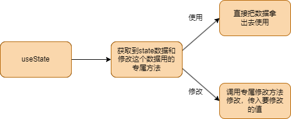

# 函数组件和hooks

**函数组件和类组件的主要区别**

1. 函数组件没有生命周期
2. 函数组件没有this
3. 函数组件通过hook来完成各种操作
4. 函数组件本身的函数体相当于render函数
5. props在函数的第一个参数接受

**相当于render函数，return 的内容相当于组件的html**

## 一.state的创建和更新



```jsx
import { useState } from "react";
function App() {
  let [msg, setMsg] = useState("hello");
  return <div>
    {msg}
    <button onClick={() => { setMsg("hello world") }}>change message</button>
  </div>
}

export default App;
```
`useState`函数返回一个数组，第一个元素是当前状态，第二个元素是更新状态的函数。

**二.useEffect:** 定义副作用,useEffect开始就会执行一次

1. 不传第二个参数 = `componentDidMount` 和 `componentDidUpdate`
2. 第二个参数传空数组 =`componentDidMount`
3. 第二个参数数组里放某个数据 = watch监听

```jsx
import { useEffect, useState } from "react";

function App() {
  let [msg, setMsg] = useState("hello");
  let [msg2, setMsg2] = useState("world");

  useEffect(() => {
    console.log("effect");
  }, [msg]);

  return <div>
    {msg}
    {msg2}
    <button onClick={() => { setMsg("hello world") }}>change message</button>
    <button onClick={() => { setMsg2("goodbye") }}>change message 2</button>
  </div>
}

export default App;
```
运行button点击后，会打印`effect`，因为msg是依赖项，所以会重新执行`useEffect`，但是第二个并不会重新执行。

**三.useMemo:** 让一段计算在开始运行一次，后续只有依赖的数据发生变化才会重新计算。

1. 类似于vue的一个计算属性的效果
2. 缓存一个数据，让其不会重新创建

```jsx
import { useEffect, useState, useMemo } from "react";

function App() {
  let [msg, setMsg] = useState("hello");
  let [msg2, setMsg2] = useState("world");
  let [arr, setArr] = useState([1, 2, 3]);

  let all = useMemo(() => {
    let all = 0;
    arr.forEach((item) => { all += item; })
    return all;
  }, [arr])

  useEffect(() => { console.log("effect"); }, [msg]);

  return <div>
    <div>{msg} <button onClick={() => { setMsg("hello world") }}>change message</button></div>
    <div>{msg2} <button onClick={() => { setMsg2("goodbye") }}>change message 2</button></div>
    <div>{all} <button onClick={() => { let _arr = [...arr, 4]; setArr(_arr) }}>change array</button></div>
  </div>
}

export default App;
```
点击按钮后，只有msg2和arr发生变化，all才会重新计算。

**四.useCallback:** 缓存一个函数，让其不会每次更新都重新创建。

```jsx
let changemsg = useCallback(() => { setMsg("hello world") }, [msg]);
```

## 其他一些hook

**useRef:** 获取dom节点,函数组件中使用ref

**useContext:** 更方便的解析context的provider的数据

```jsx
import { useContext } from "react";
import { Context1 } from "./App";
function Son() {
    let value = useContext(Context1);
    console.log(value);
    return <div>Son</div>;
}
export default Son;
```
**函数组件中传递context数据，需要用到`useContext`**

## 总结

`useMemo`,`useEffect`,`useCallback` 第二个参数的作用都是有意义的

Hook还有很多，hook只能用于函数组件中，不能用于类组件中。