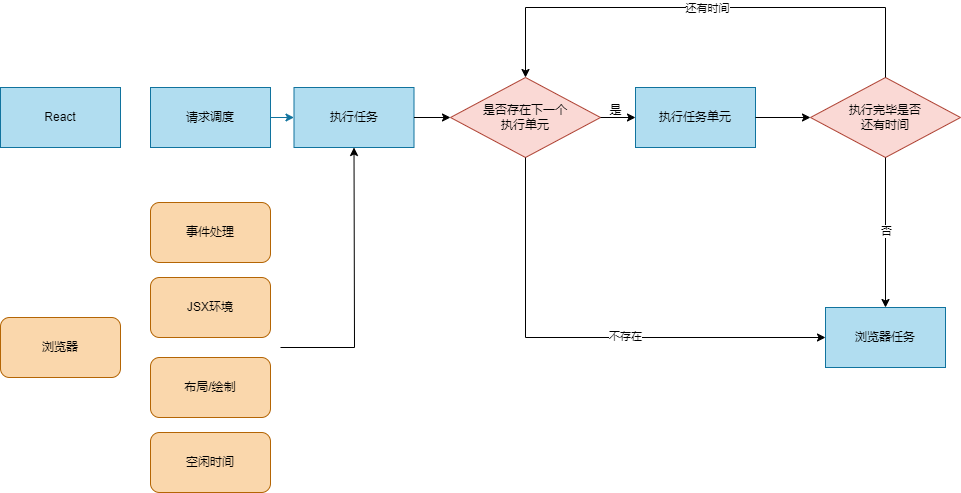

# React的性能问题和优化

React最大的性能问题就是某个组建的更新会连带着，子组件一起更新。

虚拟dom对比和计算绘画很大时间，这样会阻塞浏览器的工作，react的方案是使用--时间切片，先计算一部分更新，再让渡给浏览器渲染。

**React渲染逻辑**

**fiber**

为了支持这种切片，我们需要把更新化成一个个单元，然后我们也必须有回复上一次计算进度的能力。

所以react设计一种数据结构--fiber，它是一种树结构，每个节点代表一个更新单元，它包含了组件的类型、props、state、context、hooks等信息。
