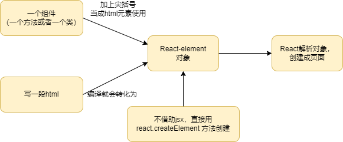

# jsx语法

## jsx 的特点

**直接js中混用:** React项目利用babel做了对js的编译，jsx可以直接写在js文件中，这样可以更方便的与js代码混用。

**写法接近js:** jsx的语法和js很相似，不同点在于，可以更方便的写html在js里，写在js里的html代码会被编译成js对象，我们也可以使用creatElement方法来创建这个对象。

```jsx
import './App.css';
import React from 'react';

function App() {
  function HelloWorld() {
    return React.createElement("div", [null], "Hello World")
  }
  return (
    <div className="App">
      <HelloWorld />
    </div>
  );
}

export default App;
```

## jsx 代码的本质

编写jsx代码的本质，最终显示的结果是React.createElement()方法的调用。




也可以使用let来定义，然后在jsx中使用。不需要使用尖括号，只需要使用花括号包裹，在jsx中使用`<>`会解析为`React.createElement()`方法。

```jsx
import './App.css';
import React from 'react';

function App() {
  function HelloWorld() {
    return <div>Hello World</div>;
  }

  let hello = HelloWorld();

  return (
    <div className="App">
      {hello}
      <HelloWorld />
    </div>
  );
}


export default App;
```

## 渲染规则

| 规则                    | 描述                   |
| ----------------------- | ---------------------- |
| 字符串，数字            | 直接渲染               |
| 对象                    | 只能渲染element对象    |
| 数组                    | 数组中的每一项都渲染   |
| 表达式                  | 运行表达式，并渲染结果 |
| 方法                    | 无法渲染               |
| 布尔值，null，undefined | 不渲染任何内容         |