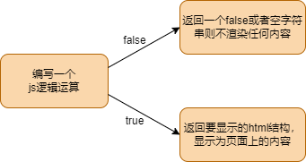

# 条件渲染和列表循环

React没有指令，一切操作的本质都是通过计算生成不同的内容，拿去渲染，得到不同的页面。

## 条件渲染的本质

**原则：**

1. react渲染undefined,null,false,空字符串不会渲染成任何内容。
2. 如果渲染一个jsx编写的html元素，就会渲染成页面上的内容。



```jsx
class App extends React.Component {
  state = {
    show: true
  }
  f1() {
    if (this.state.show) {
      return <div>Hello World</div>
    } else {
      return null
    }
  }
  render() {
    return <div className="App">
      {this.f1()}
      <button onClick={() => {
        this.setState({
          show: !this.state.show
        }
        )
      }}>{this.state.show ? 'Hide' : 'Show'}</button>
    </div>
  }
}
```

## 列表循环的本质

**原则**

1. 渲染一个数组会把数组里的每一项单独取出渲染

2. 那么我们编写一个里面存放的都是html结构的数组，就会渲染成列表。

```jsx
class App extends React.PureComponent {
  state = {
    originArr: [1, 2, 3, 4, 5]
  }

  addData = () => {
    let _arr = [...this.state.originArr]
    _arr.push(Math.random() * 10);
    this.setState({
      originArr: _arr
    })
  }

  render() {
    return <div className="App">
      <div>列表渲染</div>
      {this.state.originArr.map((item) => { return <div key={item}>{item}</div> })}
      <button onClick={this.addData}>addData</button>
    </div>
  }
}
```