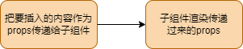
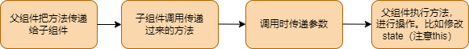

# Props 和组件间传值，插槽

**props 是 react组件的核心**

在react中，一切写在组件上的属性和子节点都被视为规划为了props。

所以props是很多react功能的根本。父子component之间的通信，状态管理，以及组件的复用都离不开props。

```jsx
class App extends React.PureComponent {
  state = {
    mes: "hello son"
  }
  render() {
    return <div className="App">
      i am App
      <Son mes={this.state.mes}>
        <div>
          i am son
        </div>
      </Son>
    </div>
  }
}
```
```jsx
class Son extends React.Component {
    state = {
        sonMes: 'Hello'
    }
    render() {
        console.log(this.props);
        return <div>
            {this.props.mes}
            {this.state.sonMes}
            i am son of App
        </div>
    }
}
```

**props的类型验证和默认值**

```jsx
Son.propsType = {
    mes: function (props) {
        if (typeof props.mes !== 'string') {
            throw new Error('mes must be a string');
        }
    }
}

Son.defaultProps = {
    mes: 'default message',
}
```

React.PropTypes 已经被废弃，建议使用 PropTypes 来代替。

```jsx
Son.propsType = {
    mes: PropTypes.string.isRequired,
}
```

## 插槽

插槽的本质就是子组建的html内容需要父组件传入，在jsx的加持下，我可以把html想普通的字符串，数字一样传递，所以插槽只需要直接作为props传入就行


```jsx
  render() {
    return <div className="App">
      <Son a={<div>i am a</div>} scopeslot={(scope) => { return <div>{scope}</div> }} mes={this.state.mes}>
        <div>i am slot</div>
      </Son>
    </div>
  }
```

```jsx
class Son extends React.Component {
    state = {
        sonMes: 'Hello'
    }
    render() {
        return <div>
            {this.props.a}
            {this.props.mes}
            {this.state.sonMes}
            {this.props.children}
            {this.props.scopeslot(this.state.sonMes)}
        </div>
    }
}
```
插槽可以做到父子组件之间传递信息，并且可以自定义html内容，可以让父组件更加灵活的控制子组件的显示。



```jsx
class App extends React.PureComponent {
  state = {
    mes: "i am App"
  }
  changeMes(sonmes) {
    this.setState({
      mes: sonmes
    })
  }
  render() {
    return <div className="App">
      <Son mes={this.state.mes} changeMes={this.changeMes.bind(this)}> </Son>
    </div>
  }
}
```
```jsx
class Son extends React.Component {
    state = {
        sonMes: 'Hello'
    }
    render() {
        return <div>
            {this.props.mes}
            <button onClick={() => {
                this.props.changeMes(this.state.sonMes);
            }}>Change</button>
        </div>
    }
}
```
父组件通过changeMes方法改变子组件的状态，子组件通过props.changeMes方法改变父组件的状态。