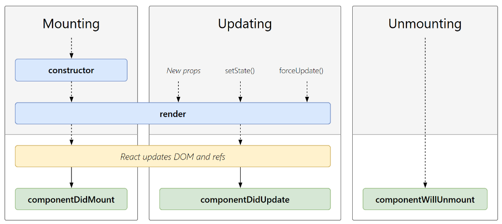

# 生命周期

**react组件的生命周期可以分为三个阶段：**

**1. 挂载阶段：** 组件被创建并插入到DOM中，此时组件的状态是未知的，组件的属性和状态都可以被设置。
**2. 更新阶段：** 组件的状态发生变化，组件需要重新渲染，此时组件的属性和状态都可以被更新。
**3. 卸载阶段：** 组件从DOM中移除，此时组件的状态也会被销毁。



```js
constructor(props)
```
挂载时独有的初始化方法，在这个方法中，可以对组件的状态进行初始化。

```js
render()
```
一个很重要的生命周期，它返回一个React元素，描述了组件在屏幕上应该呈现的内容。

传入`props,setState()`,`forceUpdate()`等方法可以触发更新。

```js
shouldComponentUpdate()
```
一个函数，在组件接收到新的props或state时，会调用这个函数，用来判断是否需要更新组件。通常在render之前

```
React update DOM and refs
```
当组件的状态发生变化时，会调用render方法重新渲染组件，然后React更新DOM并更新组件的refs。

**example**
```js
import './App.css';
import React from 'react';
class App extends React.PureComponent {
  constructor(props) {
    super(props);
    this.state = {
      mes: 'hello'
    }
  }

  static getDerivedStateFromProps() {
    console.log('getDerivedStateFromProps');
    return null;
  }
  render() {
    console.log('render');
    return <div className="App">
    </div>
  }
  componentDidMount() {
    console.log('componentDidMount');
  }
}

export default App;
```

## 严格模式

<StrictMode>

严格模式只在开发模式下生效，生产上线时会去除，作用简要概括有两方面的作用

1. 检测一些危险的操作（比如直接修改this.state,使用废弃的api等）
2. 会把一些生命周期执行两次，来检测额外副作用（比如render）

## 重点生命周期

**render:** 通过render函数的执行来决定组件渲染什么内容，所以无论更新还是初次挂载否必须执行render

**componenDidMount:** 组件挂载完成后触发，一般在这里做一些异步请求，获取数据，初始化组件的状态等操作

**shouldComponentUpdate:** 组件是否需要更新，如果返回false，则不会触发render函数，如果返回true，则会触发render函数,一般用来做性能优化

**componentDidUpdate:** 组件更新完成后触发，一般在这里做一些异步请求，获取数据，初始化组件的状态等操作

**componentWillUnmount:** 组件卸载前触发，一般在这里做一些清理工作，比如清除定时器，取消网络请求等

