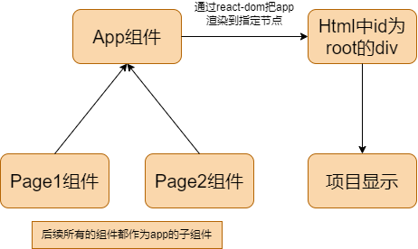

# react

## 安装 Node.js

Node.js 是一个基于 Chrome V8 引擎的 JavaScript 运行环境，可以让 JavaScript 运行在服务器端。

下载：https://nodejs.org/zh-cn/download/package-manager

## 使用creact-react-app创建React项目

```bash
npx create-react-app my-app
cd my-app
npm start
```

## 文件目录

```
my-app
├── README.md 
├── node_modules // 依赖包
├── package.json // 项目配置文件
├── .gitignore
├── public
│   ├── favicon.ico
│   ├── index.html
│   └── manifest.json
└── src
    ├── App.css 
    ├── App.js // 入口文件
    ├── App.test.js // 测试文件
    ├── index.css // 全局样式文件
    ├── index.js // 入口文件
    └── logo.svg 
```

## 两个核心库

react： React 核心库，提供react的各个功能

react-dom： 提供一些dom操作方法，比如渲染、更新、删除等

## react项目组件关系:




## 常用工具

1. [Mock.js](http://mockjs.com/) : 生成随机数据，拦截 Ajax 请求
2. [Apache ECharts](https://echarts.apache.org/zh/index.html):一个基于 JavaScript 的开源可视化图表库
3. [Reduxv5](https://www.redux.org.cn/) :于JavaScript应用的可预测状态容器
4. [Axios](https://www.axios-http.cn/docs/intro) :Axios 是一个基于 promise 网络请求库
5. [Ant Design 5.0](https://ant.design/index-cn): 助力设计开发者「更灵活」地搭建出「更美」的产品，让用户「快乐工作」～
6. [reactrouter](https://reactrouter.com/en/main):React Router 是一个基于 React 的路由管理器，用来管理单页应用中的路由和导航。
