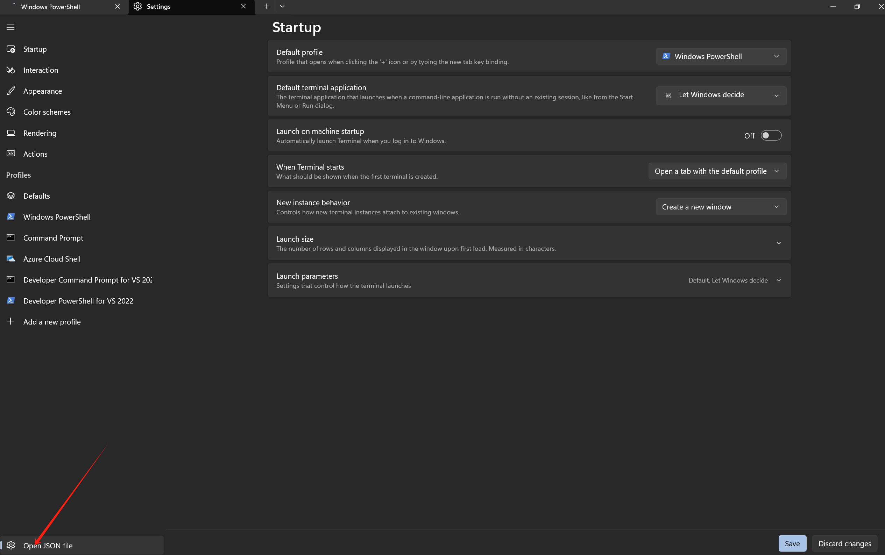

# Powershell

## 一.开启 powershell

1. `win + R`输入 pwsh

2. 管理员身份运行`ctrl + shift + enter`

## PowerShell 升级和 Windows Terminal 配置

1. 查看 powershell 当前版本

```sh
$psversiontable
```

2. 更新 powershell

查询 powershell

```sh
winget search powershell
```

3. 下载微软版

```sh
winget install Microsoft.PowerShell
```

4. 打开 json 文件
   

修改为

```sh
###
"defaultProfile": "{574e775e-4f2a-5b96-ac1e-a2962a402336}",
###
"list":
        [
            {
                "guid": "{574e775e-4f2a-5b96-ac1e-a2962a402336}",
                "hidden": false,
                "name": "PowerShell",
                "source": "Windows.Terminal.PowershellCore"
            },
        ]
```

## 二.文件相关命令

1. 进入文件夹

```sh
cd ./
```

2. 返回上级目录

```sh
cd ..
```

3. 创建新文件

```sh
ni -ItemType Directory -Path <FolderPath>
```

4. 删除文件

```sh
rm <FilePath>
```

5. 移动文件

```sh
mv <SourcePath> <DestinationPath>
```

6. 使用 vscode 打开文件

```sh
code .
```

7. 清空回收站

```sh
clear-RecycleBin -Force
```

## 三. 常用命令

### 环境变量

1. 显示环境变量

```sh
gci env:
```

2. 设置环境变量

```sh
$env:Path += <address>
```

### 网络配置

1. 显示本机 ip

```sh
ipconfig
```

2. 测试网络链接

```sh
ping <IP>
```

3. 关闭防火墙

```sh
netsh advfirewall set allprofiles state off
```

4. 显示网络统计信息

```sh
netstat -an
```

5. 显示本地路由表

```sh
route print
```

6. 配置防火墙规则

```sh
Get-NetFirewallRule
```
