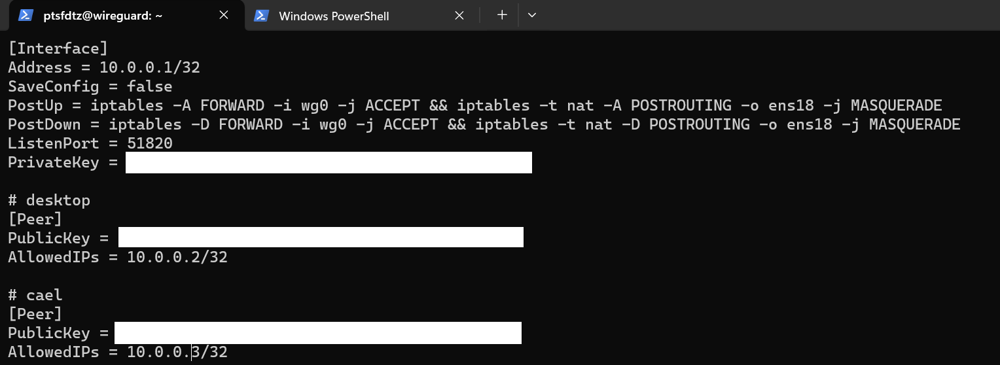

# wireguard use

## 一.安装 wireguard

### 在服务端安装

1. 获取 root 权限

```sh
sudo i
```

2. 安装 wireguard 软件

```sh
apt install wireguard resolvconf -y
```

## 二.配置服务端

### 配置服务端公钥和私钥

1. 创建一个文件夹储存公钥和私钥

```sh
cd wireguard/clients/
mkdir example
cd example
wg genkey | tee private.key | wg pubkey > public.key #创建example的私钥和公钥
```

2. 进入配置文件路径

```sh
sudo vim /etc/wireguard/wg0.conf
```

3. 使用下面的命令查看你的默认网卡：

```sh
ip route list table main default
```

如果网卡不正确**更改默认网卡 将 `eth0` 改为`enp4s0`**

4. 添加私钥和公钥
   添加以下配置：

```sh
[Interface]
PrivateKey = client_private_key
Address = 10.0.0.2/32
DNS = 114.114.114.114, 223.5.5.5

[Peer]
PublicKey = server_public_key
Endpoint = server_ip:51820
AllowedIPs = 0.0.0.0/0
PersistentKeepalive = 25
```



### 允许端口转发

1. 进入配置文件

```sh
sudo vim /etc/sysctl.conf
```

2. 取消注释以下内容

```sh
net.ipv4.ip_forward=1
```

3. 重启或者输入以下命令

```sh
sudo sysctl -p
```

### 查询方式

- 显示所有生成的密钥

```sh
cat private.key #显示私钥
cat public.key #显示公钥
```

- 显示用户组

```sh
sudo wg
```

## 三.下载客户端

```sh
https://www.wireguard.com/install/
```

## 四.配置客户端

### 配置客户端对应私钥和公钥

1. 打开客户端软件 新建隧道

2. 在配置文件添加

```sh
[Interface]
PrivateKey = client_private_key
Address = 10.0.0.2/32
DNS = 114.114.114.114, 223.5.5.5

[Peer]
PublicKey = server_public_key
Endpoint = server_ip:51820
AllowedIPs = 0.0.0.0/0
PersistentKeepalive = 25 #必须添加每25ms相应一次
```

## 五.启动服务

### 开机自启

1. 打开开机自启

```sh
systemctl enable wg-quick@wg0
```

2. 关闭开机自启

```sh
sudo systemctl disable wg-quick@wg0
```

3. 查询自启状态

```sh
systemctl status wg-quick@wg0
```

### 启动 wireguard

```sh
#启动wg0
wg-quick up wg0
#关闭wg0
wg-quick down wg0
```
