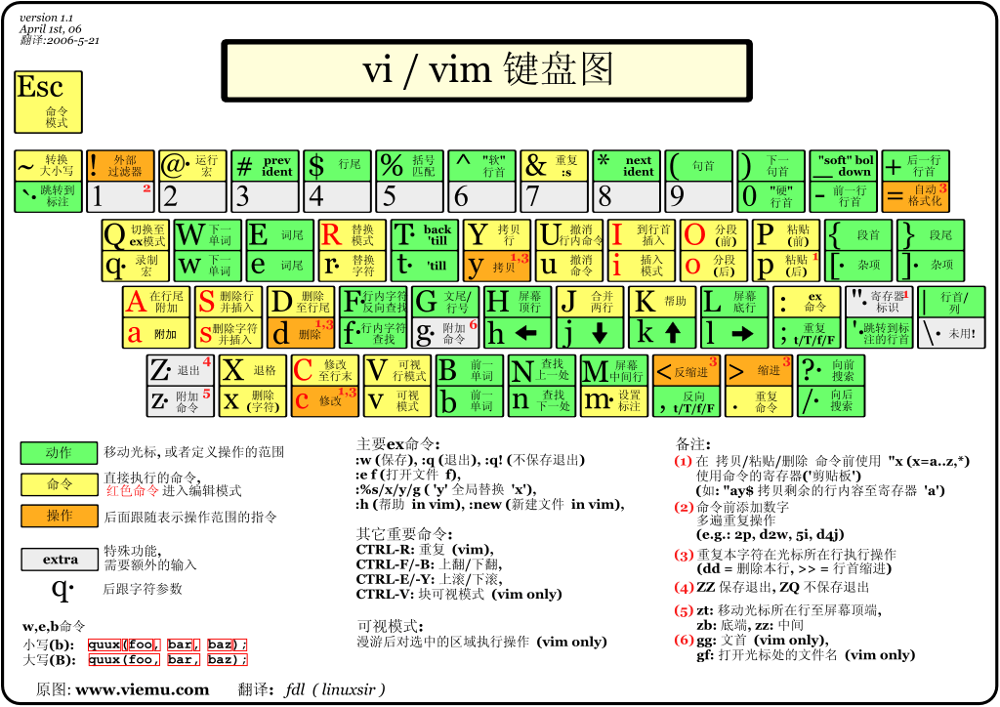

# Vim

## 下载

vim:[下载链接](https://www.vim.org/download.php)

```sh
winget search vim
winget install vim.vim
```

## 配置

```sh
vim ~/.vimrc
```
添加以下内容：

```sh
syntax on

set number
set autoindent
set tabstop=4
set shiftwidth=4
set expandtab
set smartindent
set backspace=2
set incsearch
set hlsearch
set ruler
```
## vim 键盘图



## 命令模式

- `i`:切换到输入模式

- `x`:删除字符

- `:`:切换到底线命令模式

- `dd`:删除当前行

- `yy`:复制当前行

- `u`:撤销上一次操作

- `:w`:保存文件

- `:q`:退出 vim 编辑器

- ` :q!`:强制退出

- `:wq`:保存并退出

- ` :wq!`:强制保存并退出

## 输入模式

输入时比较符合直觉

`ESC`:退出输入模式
