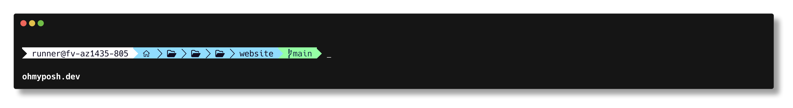
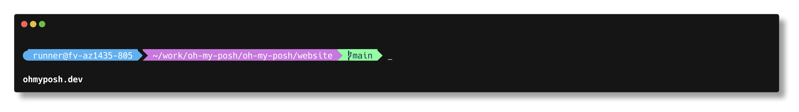
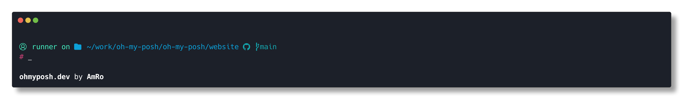
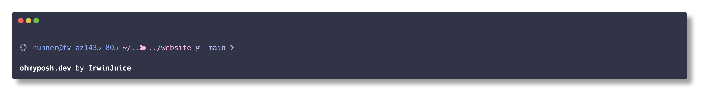

# Oh my posh

### 基础配置

**安装**

```sh
winget install JanDeDobbeleer.OhMyPosh -s winget
```

**添加到环境变量**

```sh
$env:Path += ";C:\Users\user\AppData\Local\Programs\oh-my-posh\bin"
```

**更新**

```sh
winget upgrade JanDeDobbeleer.OhMyPosh -s winget
```

### 主题配置

```sh
oh-my-posh init pwsh --config $env:POSH_THEMES_PATH\<theme.omp.json> | Invoke-Expression
```

**如果要在全局生效, 那么我们需要在 $PROFILE 文件中写入该值:**

```sh
nano C:\Users\<username>\Documents\PowerShell\Microsoft.PowerShell_profile.ps1
```

添加上面的命令, 然后重启 PowerShell 即可生效.

### 主题列表

- [agnosterplus](https://github.com/JanDeDobbeleer/oh-my-posh/blob/main/themes/agnosterplus.omp.json)

- [aliens](https://github.com/JanDeDobbeleer/oh-my-posh/blob/main/themes/aliens.omp.json)

- [amro](https://github.com/JanDeDobbeleer/oh-my-posh/blob/main/themes/amro.omp.json)

- [catppuccin](https://github.com/JanDeDobbeleer/oh-my-posh/blob/main/themes/catppuccin_frappe.omp.json)
