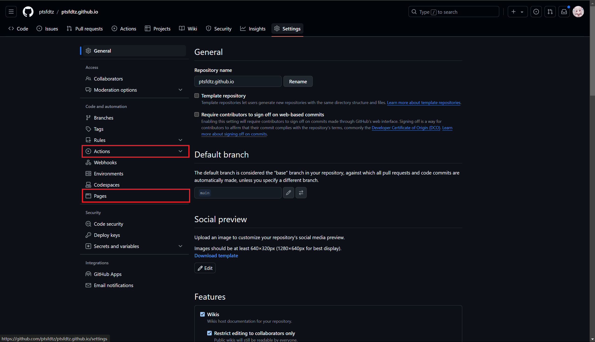

# github-pages



修改这两者的配置，就可以使用 GitHub Pages 托管自己的静态网站了。

在`.github/workflows`目录下创建`pages.yml`文件

**常见配置**

```yaml
name: pages 

on:
  push:
    branches:
      - main
  pull_request:
  workflow_dispatch:

jobs:
  pages:
    runs-on: ubuntu-latest  # 运行环境
    steps:
      - uses: actions/checkout@v3   # 克隆代码

      - uses: actions/setup-node@v3  # 安装node环境
        with:
          node-version: 18  # node版本

      - uses: actions/cache@v3      # 缓存node_modules
        with:
          path: "**/node_modules"   # 缓存路径
          key: ${{ runner.OS }}-npm-cache-${{ hashFiles('**/package-lock.json') }}  # 缓存key
          restore-keys: ${{ runner.OS }}-npm-cache-  # 缓存key

      - run: npm install       # 安装依赖
      - run: npm run build    # 编译静态文件

      - name: Deploy to github pages    # 部署到github pages
        uses: crazy-max/ghaction-github-pages@v3.1.0    # 使用ghaction-github-pages
        with:   
          target_branch: gh-pages      # 部署分支
          build_dir: public            # 编译后的静态文件目录
        env:
          GITHUB_TOKEN: ${{ secrets.GITHUB_TOKEN }}  # 令牌
```